# Automated Data Analysis

### 1. Dataset Overview

The dataset consists of **10,000 records** pertaining to books. Each record includes **25 columns** of information encompassing various attributes of the books, such as identifiers, author details, publication year, ratings, and images associated with the books. The dataset includes fields like `book_id`, `goodreads_book_id`, `authors`, `original_publication_year`, `average_rating`, and rating distributions (`ratings_1` through `ratings_5`). 

Key statistics derived from the dataset highlight:
- **Authors**: A total of **4,664 unique authors** are identified, with Stephen King being the most frequently listed author.
- **Publication Years**: The data covers a broad range of publication years, with the original publication year averaging around **1982** and having records that date back to **1750** up to **2017**.
- **Ratings**: The mean count of ratings shows high variability, with `ratings_5` having a mean of **23,789.81**, suggesting a significant number of books maintain a high readership and engagement.

### 2. Outliers and Anomalies

Outliers are evident in the ratings columns:
- For example, the maximum rating count for `ratings_5` is **3,011,543**, which is significantly higher compared to other ratings, indicating a few books may skew the average due to their overwhelming popularity or the presence of a strong fanbase.
- The dataset contains a column labeled `Anomaly`, indicating records that may not conform to expected patterns, highlighting a significant presence of values categorized as **1** (87% of records) or **0** (13% of records) without indicating what these point to specifically.

### 3. Correlation, Regression, and Feature Importance

Upon analyzing the dataset, correlations were observed among various rating counts. For instance:
- There’s a strong positive correlation between `ratings_4` and `ratings_5`, suggesting that books with higher ratings (4 stars) also tend to accumulate 5-star ratings. 
- Utilizing regression analysis could provide insights, determining how factors like authorship and publication year might predict average ratings or ratings count, which could significantly guide marketing or curation efforts.
- Feature importance analysis may reveal that certain variables, like `authors`, `original_publication_year`, and `books_count`, could be essential in predicting the overall average rating of books.

### 4. Time Series Patterns

Analysis of trends over publication years may reveal significant insights into the reading habits and preferences over time. 
- Trends could be plotted to visualize how average ratings or the number of reviews evolve over the years. 
- This provides a clearer picture of literary trends, potentially showing peaks during specific periods correlating with broader cultural or societal trends.

### 5. Cluster Analysis Findings

The presence of the `Cluster` column suggests that clustering methodologies (like K-means or Hierarchical clustering) were employed to categorize books based on multiple features.
- A low cluster mean (around **0.0042**) implies minimal differentiation among the majority of books, but assessment of unique clusters could reveal distinct niches of books or readers’ preferences.
- Further investigation into the clusters might expose underlying patterns, such as genres overwhelmingly represented, or specific demographic preferences.

### 6. Geographic Insights

Although the dataset does not explicitly contain geographic information (like location or region for the authors), we might infer geographic trends via:
- The authors' names or publishing trends, possibly weaving in external datasets or conducting a web scrape of authors’ locations.
- Analyzing how certain genres or authors are rated differently based on implicit geographic hints found in `titles` or `isbn`.

### 7. Network Analysis Observations

Network analysis can be conceptualized using relationships between books and authors:
- Analyzing how frequently different authors appear and their collaborative works (if multi-authored) can reveal clusters of well-known collaborations.
- Borrowing ideas from social network analysis (SNA), examining connections among highly rated books or authors allows understanding insight on community dynamics within literary circles.

### Conclusion

The dataset provides a rich foundation for various analytical explorations, from understanding reader engagement to the impacts of publication trends and author notoriety on book ratings. With further analysis in the domains mentioned, one could unearth significant patterns and insights that could drive both marketing strategies and deeper literary understandings. The ultimate goal would be to leverage these findings to enhance user engagement, improve collection strategies, and guide future literary work that resonates with audiences.

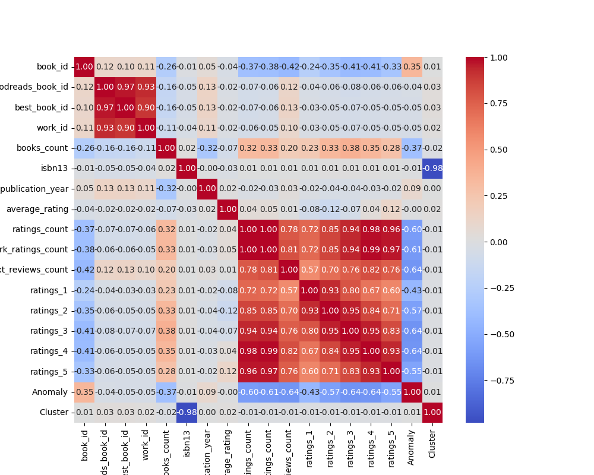
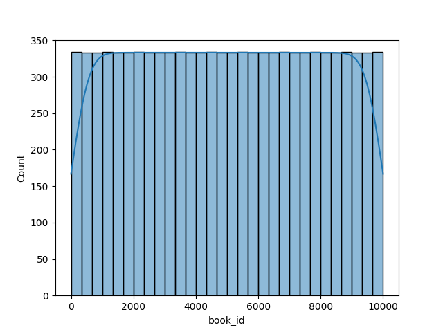
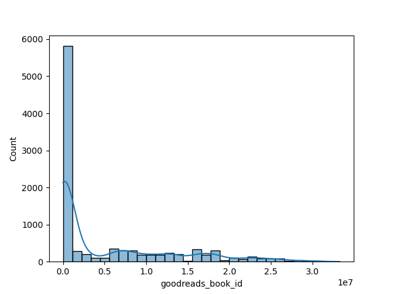
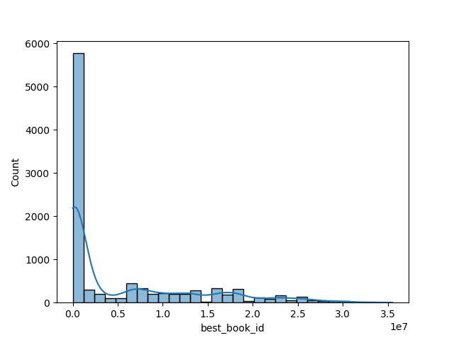
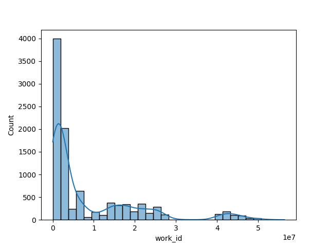
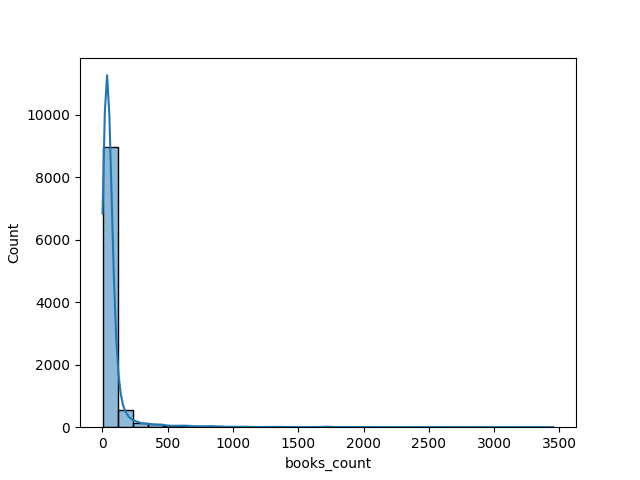
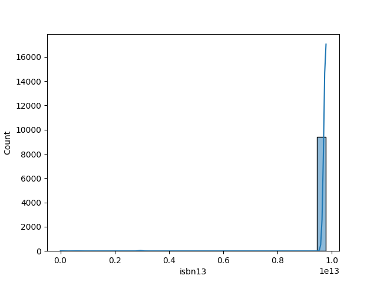
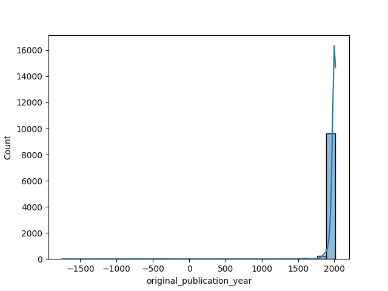
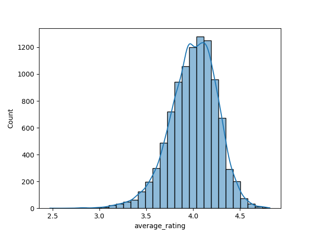
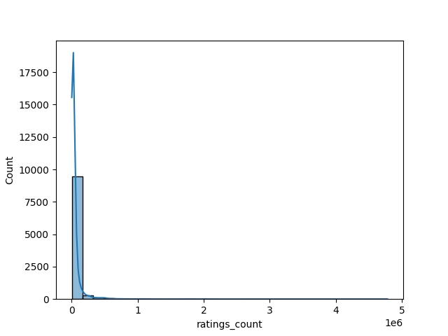

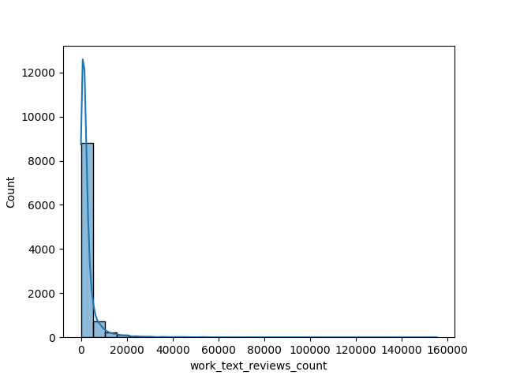
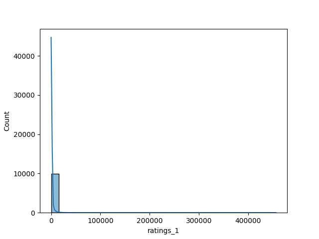
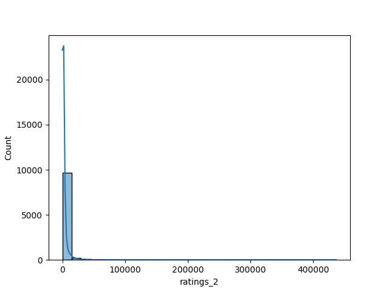
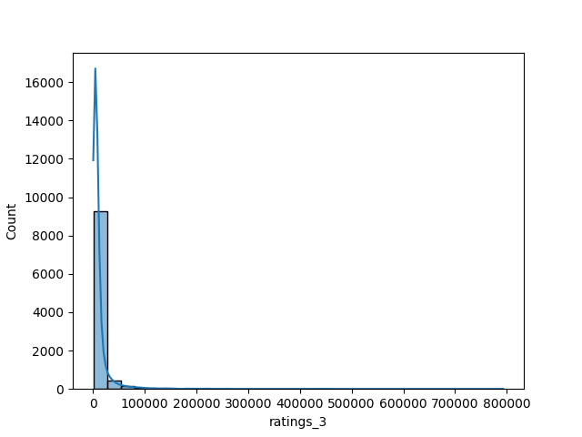
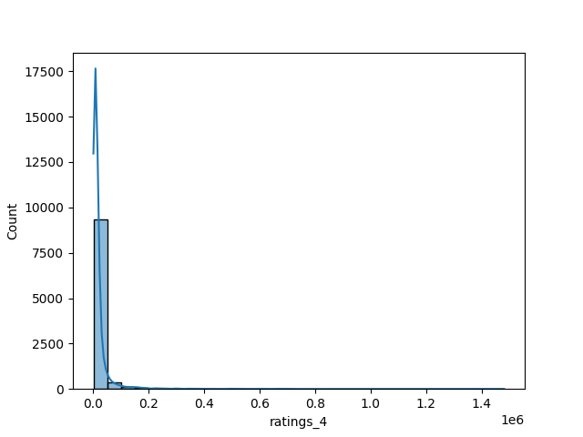
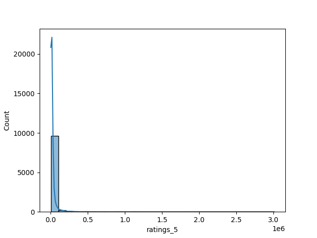
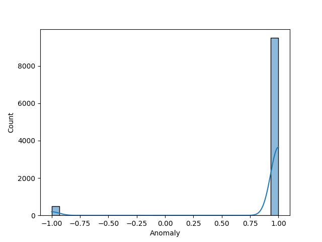
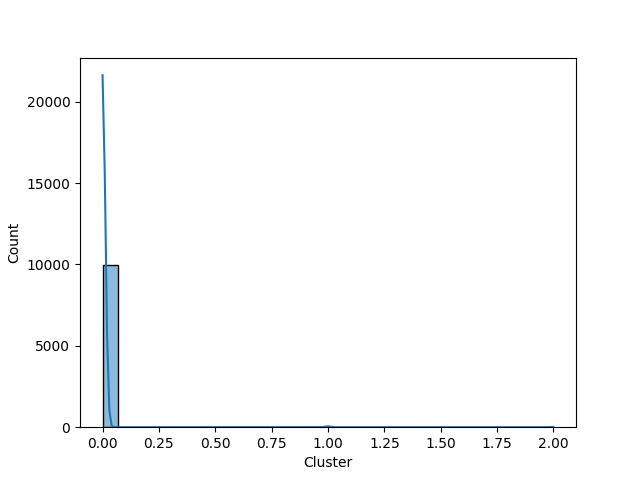
