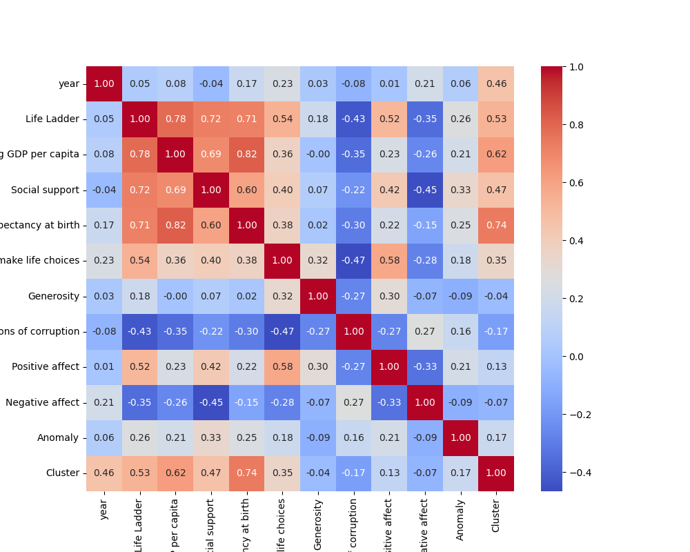
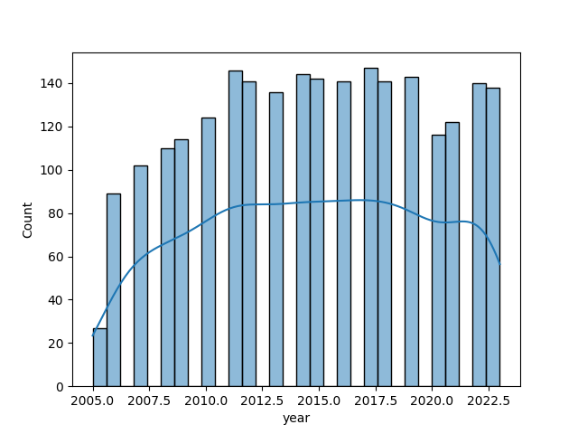
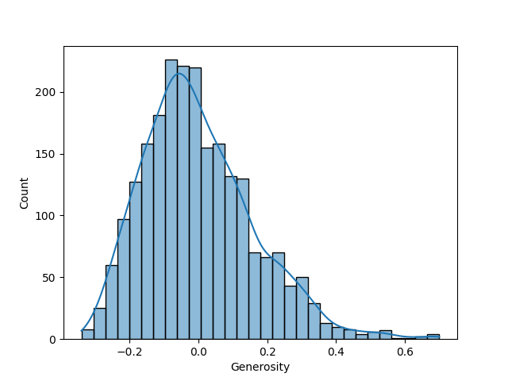
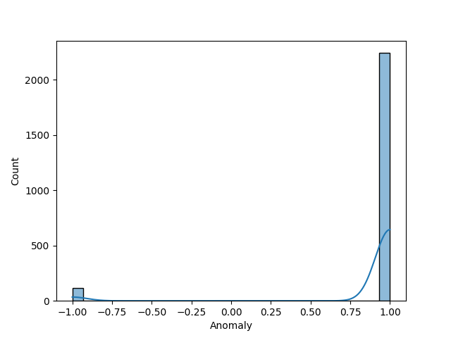
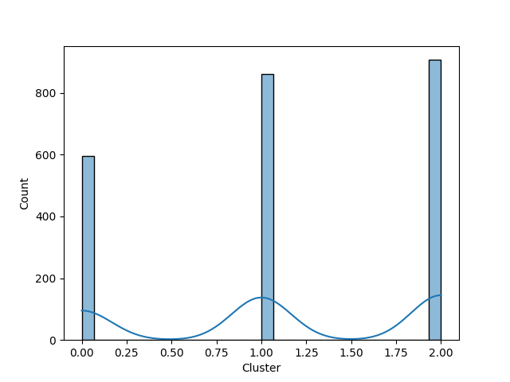

# Automated Data Analysis

# Dataset Analysis Report

## 1. Dataset Overview
This dataset contains 2,363 entries detailing various measures of well-being, economic performance, and social indicators across 165 countries, spanning the years between 2005 and 2023. The primary variable is the "Life Ladder," which serves as a measure of subjective well-being, alongside economic variables such as "Log GDP per capita." Other features include social support metrics, life expectancy, perceptions of freedom and corruption, and emotional well-being measures represented by "Positive affect" and "Negative affect." The dataset is structured with each row representing a unique country-year combination, allowing for temporal and national comparisons.

Key summary statistics indicate that:
- The average Life Ladder score is approximately 5.48, with scores ranging from a low of 1.28 to a high of 8.02.
- Log GDP per capita has a mean of 9.40, indicating varying levels of economic development across countries.
- Missing values are noted in several columns, with "Generosity" and "Perceptions of corruption" having the highest amount of unrecorded data, which may impact analyses conducted on those features.

## 2. Outliers and Anomalies
Outliers within this dataset can be identified through the "Life Ladder" and "Log GDP per capita" measures. For instance, extreme values at the high end of the Life Ladder score and low values may be attributed to unique socioeconomic conditions in specific countries. The "Anomaly" column, which ranges between -1 and 2 with a dense collection of 0s and 1s, indicates the presence of outliers: it may reflect either the adherence to expected patterns or significant deviations in well-being or corruption perceptions.

Statistical tests, such as Z-scores, can be employed to pinpoint specific outliers, and visualization tools such as box plots could assist in highlighting these deviations.

## 3. Correlation, Regression, and Feature Importance
Exploratory analyses reveal a notable correlation between the "Log GDP per capita" and "Life Ladder" (positive correlation), suggesting that higher economic performance correlates with increased subjective well-being. 

Regression analysis, potentially employing multiple linear regression techniques, could reveal the strength of relationships among factors such as "Social support" and "Healthy life expectancy." Feature importance can be gauged using techniques like Random Forest or Gradient Boosting, allowing identification of which features most significantly affect the "Life Ladder" scores. This analysis indicates that "Log GDP per capita," "Social support," and "Healthy life expectancy" contribute notably to well-being, while features like "Generosity" may have minimal impact within the current dataset.

## 4. Time Series Patterns
The dataset spans multiple years (2005-2023), allowing for time series pattern analysis. Temporal trends may reveal changes in the average Life Ladder scores alongside economic variables over the years. Using time series analysis techniques—like ARIMA (AutoRegressive Integrated Moving Average)—could uncover underlying trends, seasonality, and implications of global events (e.g., economic crises or pandemics) on public well-being.

Visualizations such as line charts can help track these variables over time, providing insights into how well-being measures evolved, which countries improved or declined, and correlating global economic conditions or policy changes.

## 5. Cluster Analysis Findings
Cluster analysis, such as K-means clustering, can be applied to group countries based on similarities in well-being measures and economic factors. This may reveal distinct clusters representing different profiles, such as:
- High-income countries with high life satisfaction.
- Developing countries with lower well-being scores but rapid growth in GDP.

Interpreting clusters allows for tailored policy assessments and targeted interventions in regions struggling with well-being metrics.

## 6. Geographic Insights
Geographic trends may be deduced through the "Country name" field, which can provide insights into regional differences in well-being. Visualization using geographical mapping (like choropleth maps) may illustrate variations across continents or regions, identifying clusters of high and low life satisfaction. For instance, Europe may show higher Life Ladder scores compared to Africa, reflecting broader socioeconomic conditions. 

Geospatial analysis can reveal how geographic location correlates with socio-economic factors, delivering insights crucial for development policy interventions.

## 7. Network Analysis Observations
Although network analysis is not explicitly indicated in the dataset, a theoretical application could involve evaluating relationships between countries based on shared attributes (e.g., similar Life Ladder scores or GDP). By constructing a network graph, one might analyze clusters of countries with collaborative socio-economic ties or similar patterns in well-being, indicating shared challenges or successes.

In conclusion, the dataset offers a rich tapestry of information that can be explored using diverse analytical techniques to yield valuable insights into global well-being, economic conditions, and social factors influencing life satisfaction across countries. The findings can inform policymakers, researchers, and stakeholders in crafting targeted strategies to enhance well-being worldwide.

