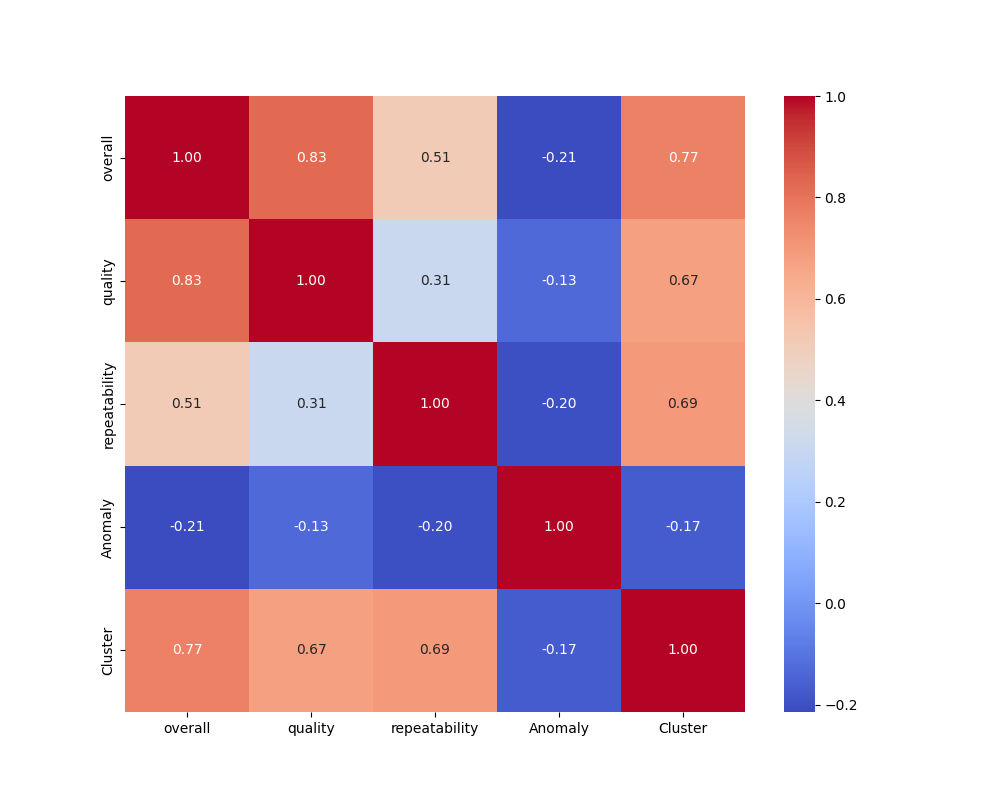
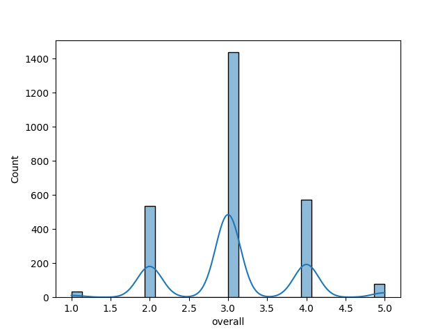
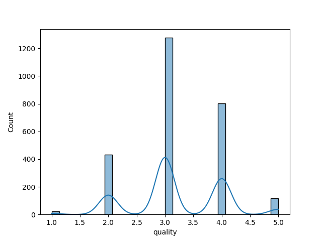
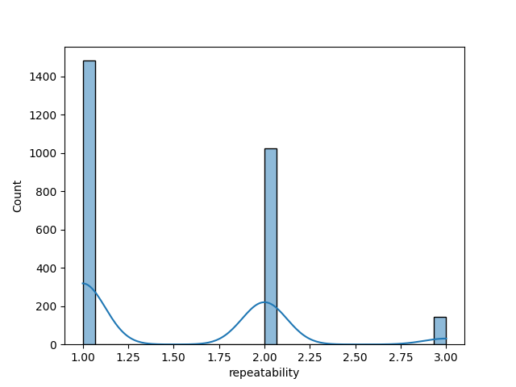
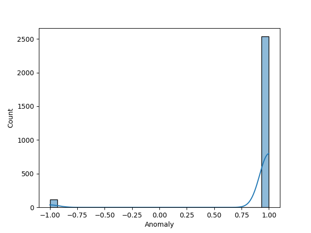
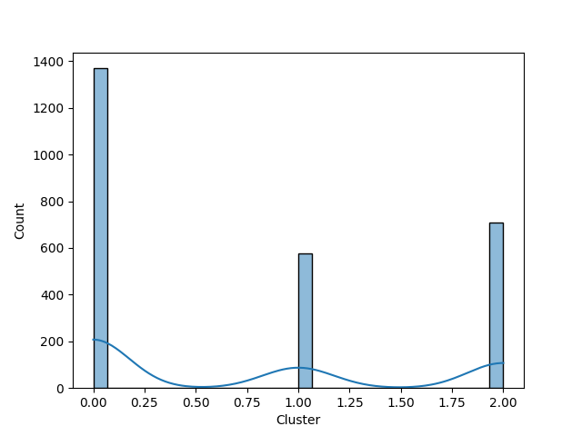

# Automated Data Analysis

## Dataset Analysis Narrative

### 1. Dataset Overview
The dataset comprises 2,652 entries, each recording information related to films or shows, characterized by various attributes such as `date`, `language`, `type`, `title`, `by`, `overall`, `quality`, `repeatability`, `Anomaly`, and `Cluster`. Notably, the `date` attribute spans from June 18, 2005, to November 15, 2024, suggesting a collection of films and shows over nearly two decades. The dataset contains information about films in 11 different languages, with English being the most frequently represented language, appearing in 1,306 instances. 

The `type` attribute classifies entries into eight categories, predominantly films (2,211 instances). The quality of the entries is rated on a scale from 1 to 5, revealing an average quality rating of approximately 3.21 across the dataset. Furthermore, attribution appears to reflect various directors or producers, with Kiefer Sutherland being the most frequently mentioned, appearing 48 times. 

However, the dataset also includes some missing values, particularly notable in the `by` column, where 262 entries are absent. This may signal incomplete reporting for those films or shows.

### 2. Outliers and Anomalies
The presence of anomalies in the dataset is indicated by the `Anomaly` column, which contains values that signify whether certain entries diverge from standard patterns. With a mean value of 0.91, it appears that a considerable majority of the entries contain at least one anomaly, characterized by extreme or unexpected values in one or more features. 

To further investigate outliers, quality ratings and overall scores should be examined for extreme values that might skew analysis, particularly considering the standard deviation of `quality` is noted to be approximately 0.80, suggesting the presence of outlier entries with disproportionately high or low scores.

### 3. Correlation, Regression, and Feature Importance
The dataset allows for analysis of potential correlations between the numerical features: `overall`, `quality`, and `repeatability`. The mean values suggest a moderate relationship, with `overall` ratings likely influencing `quality` and `repeatability`. The correlation coefficient can be computed to confirm this hypothesis; higher correlation values would reinforce relationships between these variables, indicating that as the overall score increases, so too does the quality and repeatability.

In terms of regression analysis, it would be beneficial to assert predictive models where `quality` might be predicted using `overall` and `repeatability` as independent variables, thus assessing how well these factors contribute to the film’s quality ratings.

### 4. Time Series Patterns
The `date` field offers rich opportunities for time-series analysis, allowing for an examination of trends over time in film releases and their ratings. A time-based aggregation of the data can reveal trends in film quality ratings based on release year, monthly patterns, and seasonal variations. For instance, it could elucidate whether certain months yield higher quality films or if there are notable years where quality ratings peaked due to an influx of specific genres or filmmakers.

Visualizations like line charts can be employed to depict these trends, demonstrating how quality and overall ratings evolve over the given timeline.

### 5. Cluster Analysis Findings
The `Cluster` variable categorizes films into three clusters, representing patterns uncovered during clustering analysis. Investigation into the clusters could reveal distinct group characteristics, such as clustering films by genres or release years, and how these align with their respective quality and overall ratings. By inspecting the average quality and repeatability within each cluster, we can identify which groups produce the highest quality films and which are associated with lower ratings.

### 6. Geographic Insights
Unfortunately, the current dataset does not include explicit geographic information, making it challenging to conduct geographic insights. To enhance the dataset’s utility, it would be beneficial to integrate geographic data, such as the country of production, which would facilitate a region-based analysis of film quality and preferences.

### 7. Network Analysis Observations
Given the information on directors or producers indicated in the `by` field, a network analysis could illuminate relationships between key figures in the dataset. Analyzing the co-occurrence of directors and the films they produce may reveal collaborative patterns or indicate which individuals consistently yield high-quality outputs. 

Visualizations such as network graphs can help illustrate these relationships, showing how certain nodes (directors) are connected through shared films in a manner that highlights the influence of collaboration on quality outcomes.

### Conclusion
The dataset offers a wealth of information ripe for exploration across various analytical lenses. While it highlights significant correlations and trends, further investigation into clusters, time-based patterns, and potential relationships among filmmakers could yield insights that inform the film industry, consumer preferences, and creative collaborations. Integrating missing values, particularly in the attribution field, could enrich the analysis and provide a more holistic view of the dataset.

